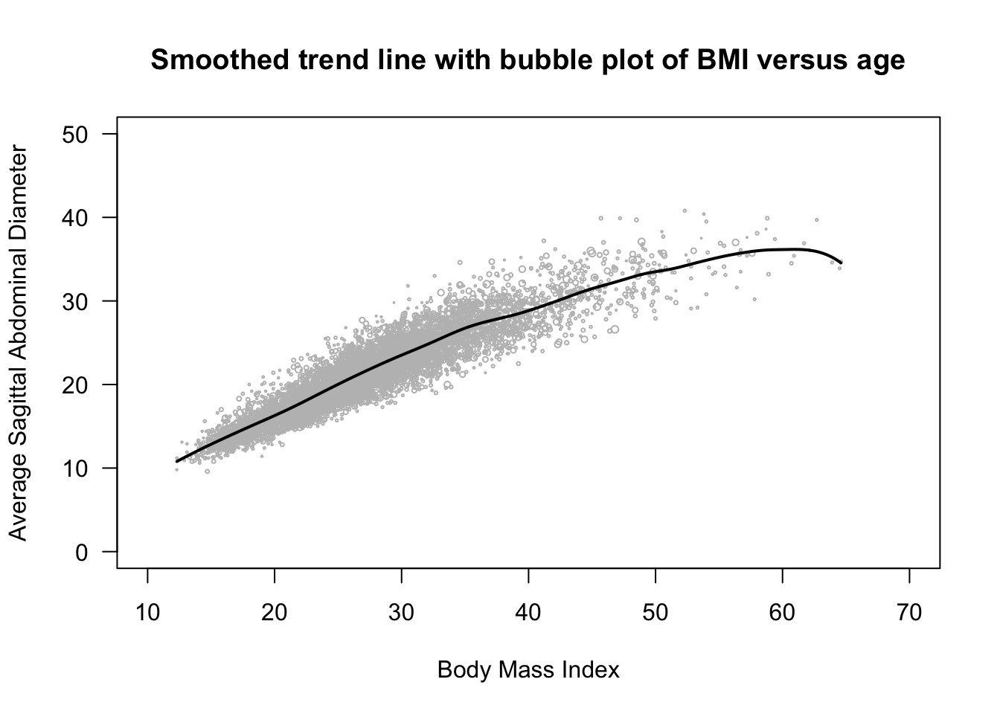
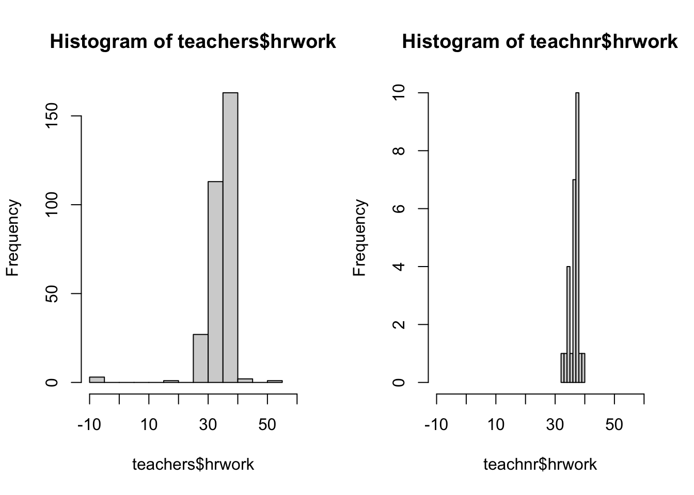

# Analysis of Health Data, Non-Response Bias, and Imputation Methods
## STAT 472: Sampling Theory & Practice

### This is a project I completed for my Sampling Theory & Practice class. In this project I developed my skills:
- Handling, understanding, and analyzing health statistics through the NHANES (National Health and Nutrition Examination Survey) dataset.
- Calculating response rate, qualitatively analyzing reasons for non-response, and comparing means, variances, and other statistics between groups to gain insight.
- Finding the best imputation method for missing values, practicing mean imputation, and coding efficient loops for repeatable tests.
- Qualitative analysis for survey design and experimental design.
- Creating data visualizations that clearly depict apparent trends. 

### For this I used the following tools:
- RStudio & R
- Github
- [NHANES Documentation](https://wwwn.cdc.gov/nchs/nhanes/)

### Data Visualizations:

| Data Visualization | Description | Conclusions |
|---|---|
|| Weighted bubble plot with smoothed trend line for BMI vs age from NHANES data.| BMI (Body Mass Index) has a positive correlation with SAG (sagittal abdominal diameter, a measure of visceral obesity): as BMI rises, so does the SAG. However, with higher values the data becomes more spread out, and BMI becomes a less reliable predictor for SAG. This implies that BMI may only be a reliable predictor of visceral body fat in some ranges.|
| | Two histograms contrasting the typical required amount of work hours for the groups of respondents vs non-respondents. | The two histograms center around the same value, about 37 hours. The first histogram has a greater number of observations and therefore has greater spread. Overall, they both present similar findings, demonstrating poor evidence for a difference in the groups.|
